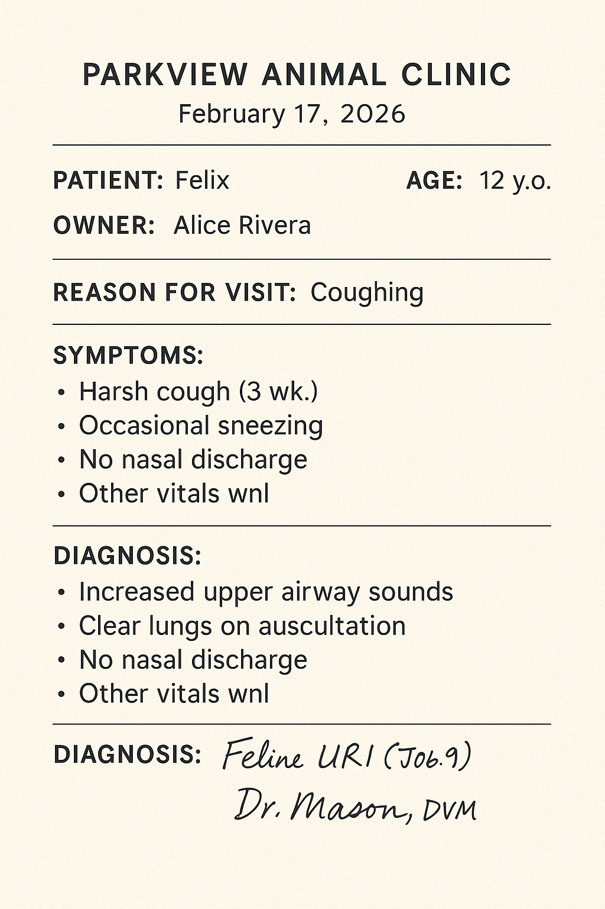
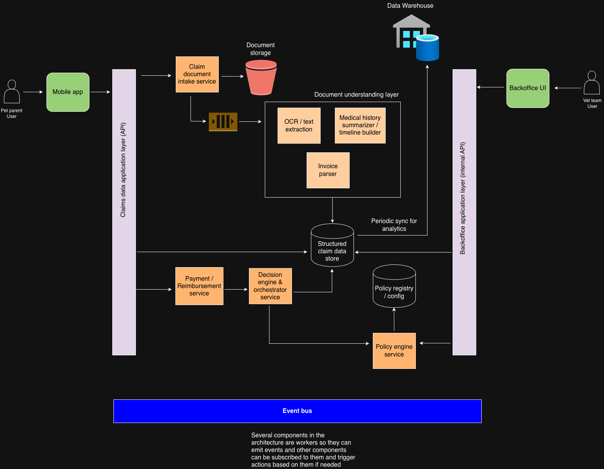

# Automation of veterinary claims process

## Table of Contents

- [Problem analysis](#problem-analysis)
  - [Problem definition](#problem-definition)
  - [Key parts to solve](#key-parts-to-solve)
  - [Constraints, risks, complexities](#constraints-risks-complexities)
- [Problem decomposition](#problem-decomposition)
- [System design](#system-design)
  - [Key design principles](#key-design-principles)
  - [High level components (described in detail in following section)](#high-level-components-described-in-detail-in-following-section)
  - [Component details](#component-details)
- [Pros and cons of this approach](#pros-and-cons-of-this-approach)
- [Planning](#planning)
  - [Phases in order](#phases-in-order)
- [Traditional ML vs LLM](#traditional-ml-vs-llm)
- [System at scale (1k claims to 10k to 100k)](#system-at-scale-1k-claims-to-10k-to-100k)
- [Bonus](#bonus)

Note: some fake documents have been added in the proposal to visually support in the thought process

## Problem analysis

### Problem definition
From a first principles approach the automation must repeatedly answer the question:

> “Given this claim (invoice, veterinary report, policy, pet's medical history if needed), what amount should we reimburse, and why?”

To answer that, the vet team before the automation had to do a series of human sub-decisions:
  - Document understanding
    - Is the invoice valid? What are the line items, amounts, dates?
    - What does the vet report say about symptoms, diagnosis, treatment?
    - Does any document mention chronic/pre-existing conditions?
    <br></br>
    
    
    <br></br>

  - Policy application
    - Does this policy cover these types of treatments/conditions?
    - Are there exclusions? Sublimits? Deductibles? Co-pays?
    <br></br>
    
    <br></br>

  - Temporal / eligibility checks
    - Did symptoms/conditions exist before policy start?
    - Does this fall into a waiting period ("periodo de carencia")?

  - Reimbursement calculation
    - Which invoice lines are covered?
    - How much is reimbursable after applying all rules?
  
  - Explanation & communication
    - Can we explain to the pet parent why we covered X and not Y?

Any automation we design should:
```
- Replicate these decisions with enough fidelity.
- Be auditable and explainable.
- Allow the insurer to control risk (e.g. never fully auto-approve ambiguous high-value claims).
```

### Key parts to solve
1. Structured understanding of unstructured documents
  - Invoice parsing (including line items, VAT, clinic details, dates).
  - Vet report understanding (conditions, diagnosis, procedures, dates).
  - Medical history summarisation vs pre-existing conditions.
    - The medical history is probably a fragmented collection of documents (invoices mixed with reports, different styles, formats, etc).
    The goal is to build a timeline view of that pet's medical history that allows to distinguish chronic or
    pre-existing conditions from acute one-off events. 
    - Note: this medical history view can be built when the insurance is bought and not left for when a claim is requested and
    time may be of the essence. 

2. Explicit representation of policy logic
  - Policy terms must be represented in a machine-friendly format (rules/parameters), not buried in PDFs.
  - Need a way to evolve rules without shipping new code for every change.
    - Storing the rules data as config seems the best approach, JSON format could be a good fit also allowing schema-less in case policies change. 

3. Decision engine
  - Apply policy + documents + history to produce:
    - Coverage per line item.
    - Reasons, references to policy clauses.
    - Confidence scores (if low score a human vet may need to act to increase the confidence of that specific item).

4. Human-in-the-loop workflow
  - Decide which claims can be auto-approved vs need vet team review.
  - Give reviewers a summary + suggested decision, not a blank screen.

5. Quality and risk management
  - Accuracy metrics, error tracking.
  - Easy way to override decisions by human vet and feed that back as training data.

### Constraints, risks, complexities

- Regulatory / trust
  - Insurance decisions need justification; “the algorithm said so” is not enough.
  - You must be able to show why a claim was approved/denied (or partially approved for some items), referencing specific policy clauses.

- Data quality
  - Photos of invoices, screenshots, various formats.
  - Handwritten notes on vet reports.
  - Different clinic templates, languages, abbreviations.
  <br></br>
  
  
  
  <br></br>

- Medical domain
  - Pet health vocabulary (conditions, treatments, chronic vs acute).
  - Need consistent mapping to internal taxonomy (ICD-like codes, internal treatment categories).

- Model risk (if using ML/LLMs)
  - Hallucinations (“invented” clauses or conditions).
  - Overconfidence in borderline cases.
    - ML/LLM models can produce confidently stated outputs even when underlying signal is ambiguous (vague language on vet
    report, strong inference when a document offers limited detail, etc) which can lead to misclassifications or wrong
    assumptions for automated decisions or even human reviewers so robust safeguards are needed (calibrated confidence scores,
    uncertainty modelling, etc).
  - Drift (output deviation) when policies or typical claims change.
    - Models trained on historical data can silently degrade when the environment shifts (updates in coverage rules, introduction
    of new policy tiers, etc or changes in veterinary practice: new procedures, medications, etc). Explicit monitoring of claim result distributions
    and claim override patterns may be needed. If LLM models are used, and being retraining or fine-tuning limited, expensive or undesirable
    for compliance reasons, then the model must be used for reasoning and the input to it (the context and prompts) becomes extremely important.

- User experience
  - Pet parents want fast reimbursement and clear explanations.
  - Vets want minimal extra work (no 50 new data fields for them).

So any architecture must be:
```
- Hybrid: deterministic rule engine + ML/LLM-based document understanding.
- Explainable: decisions broken down into intermediate steps with human-readable rationales.
- Progressive: start as decision-support, move toward full automation for low-risk segments.
```

## Problem decomposition
1. Claim intake & normalization
- Collect documents from mobile app.
- Validate minimal completeness (invoice + vet report).
- OCR + file normalization.

2. Document understanding (extraction & classification)
- Extract structured invoice (line items, amounts, dates).
- Extract clinical facts:
  - Symptoms, diagnosis, treatment.
  - Condition onset date (or earliest mention).
- Classify procedures/conditions into internal categories (e.g. surgery / consultation / tests, chronic vs acute).

3. Policy modelling (can done beforehand since it's part of insurer's product)
- Represent each policy as structured data:
  - Coverage percentages per condition category.
  - Exclusions (breed, conditions, chronic, cosmetic…).
  - Deductibles, co-pays, maximum limits, sub-limits.
  - Waiting periods definitions.

4. Eligibility & coverage engine
- For each invoice line:
  - Is this line eligible given policy?
  - Is it excluded due to pre-existing condition?
  - Is it inside/outside waiting period?
- Compute reimbursable amount per line and overall.

5. Decision control & human-in-the-loop
- Define a risk/uncertainty score per claim.
- Thresholds:
  - Low-risk: auto-approve/auto-calculate
  - Medium-risk: vet checks suggestions.
  - High-risk: full manual review (but still assisted with summaries and highlighted suggestions).

6. Back-office UX for vet team
- Timeline of pet visits and claims.
- Extracted key facts (condition, dates, prior episodes).
- Suggested decision with:
  - Line-by-line coverage.
  - Links to policy rules used.
  - “Disagree/override” options.

7. Feedback, learning & monitoring
- Capture overrides and corrections.
- Use them to retrain extraction / classification models and adjust rules.
- Monitor metrics: time to decision, agreement rate with engine, financial impact.

## System design
### Key design principles
  - Separation of concerns
    - Document understanding vs policy logic vs decision orchestration vs payment / reimbursement vs UX.
  - Deterministic where it matters, probabilistic where it helps
    - Rules for applying policy; ML/LLM for extracting meaning from unstructured docs.
  - Human in the loop by default
    - Especially at the beginning and for high-value/complex claims.

### High level components (described in detail in following section)
  - Note: the stores represented in the following diagram are not necessarily meant to be different logical stores/DBs, they could be but not necessarily
  <br></br>
  
  <br></br>

### Component details
  - Claim Intake & Document Storage
    - Claims API
      - Receives new claim submissions with:
        - Pet/pet parent + policy identifiers.
        - Uploaded invoice(s), vet report, optional medical history.
      - Performs basic validation and enqueues processing (e.g. via a queue).

  - Document storage
    - Store raw documents (images/PDFs) in secure object storage.
    - Metadata in DB: claim_id, doc_type, upload_time, file_path, etc.

  - Document Understanding Layer (Sub-pipeline)
    ```
    - Note: All outputs from sub-pipeline components go into a Structured Claim Data Store (relational DB with JSON columns or a document DB).
    ``` 
    - OCR / text extraction
      - Use robust OCR for images/PDFs.
      - Normalise text (language, layout, dates).
    - Invoice parser
      - Could be:
        - Template-agnostic ML/LLM-based parser, or
        - Hybrid: regex + ML to detect line items.
      - Output:
        - Provider info, invoice date, currency, totals.
        - Line items: description, amount, quantity, category guess (consultation, imaging, meds, etc.).
    - Clinical NLP / LLM
      - On vet report and medical history:
        - Extract:
          - Date of visit.
          - Symptoms and onset timing (owner’s report).
          - Diagnosis (mapped to internal conditions).
          - Treatments/procedures performed.
          - Notes about prior episodes.
        - Map free text to:
          - Internal condition taxonomy.
          - Chronic vs acute flags.
          - Potential pre-existing condition flag + rationale.
    - Medical history summarizer
      - For the pet:
        - Aggregate past reports + claims.
        - Derive earliest mention of each chronic condition.
        - Provide a compact timeline: [date, condition, severity, treatments].

  - Policy modelling & engine
    - Policy Registry
      - For each product/policy, store a machine-readable config:
        - Coverages: {category: percentage, caps}.
        - Exclusions: {conditions, breeds, procedures}.
        - Waiting periods: {coverage_type: days from policy_start}.
        - Deductibles, co-pays.

    - Policy Engine
      - Deterministic code or rule engine (e.g. custom rules, decision tables).
      - Inputs:
        - Policy config.
        - Structured claim data (line items, condition categories, dates).
        - Pet’s medical history summary.
      - Outputs per line item:
        - Eligibility (yes/no/needs manual).
        - Reason(s) with policy references.
        - Coverage %, applicable max limits, final reimbursable amount (before global limits).
  
    - Decision Engine & Orchestrator
      - Combines:
        - Policy Engine outputs.
        - Confidence scores from document understanding.
        - Heuristics (e.g. claim amount vs historical, unusual patterns).
      - Produces:
        - Recommended decision:
          - Auto-approve, auto-reject, or needs-review.
        - Detailed explanation:
          - E.g.: “Line 2 (X-ray) not covered because waiting period for diagnostics is 30 days; policy started 10 days ago (clause 4.2).”
      - Risk scoring
        - Example factors:
          - Total amount.
          - Model uncertainty (low extraction confidence).
          - Novel conditions/procedures not seen before.
          - Edge cases in policy (near caps/limits).
      - Routing
        - Low-risk segment: straight to payment, with automatic email to user.
        - Otherwise: send to vet team UI with decision recommendation and allow override.

  - Payment / reimbursement service
    - Once claim is finalized (either auto-approved or confirmed by vet team) this service turns "approved amount" into
    actual money in the pet's parent account.
    - Inputs:
      - Decision from Decision engine
    - Requirements:
      - It should be auditable since there is actions with money involved

  - Backoffice UI for vets
    - For each claim, display:
      - Documents and extracted data side by side.
      - Invoice lines with:
        - Condition category, coverage status, amount, reasons.
      - Clinical summary:
        - Condition + timeline of prior events.
      - Decision recommendation + confidence.
    - Actions:
      - Accept/reject line items.
      - Adjust condition mapping if wrong.
      - Mark pre-existing conditions.
      - Add comments for customer-facing explanation.

    - All changes are saved as feedback events used for improving models and rules.

  - Analytics & Data Warehouse
    - Periodically sync structured claims to a warehouse:
      - For analytics, pricing, product, and future ML training.

## Pros and cons of this approach 
- Pros
  - Explainability
    - Deterministic policy engine with explicit reasons and clause references.
  - Incremental automation
    - Start as decision-support (suggestions only), then gradually move to auto-approval for low-risk claims.
  - Domain-flexible
    - Document understanding pipeline can be improved/replaced without touching policy logic.
  - Feedback loop
    - Overrides and corrections can continuously improve extraction and classification.

- Cons
    - Initial complexity
      - Building robust invoice and clinical parsers is non-trivial, especially across many clinics and formats.
    - Policy modelling effort
      - Turning existing policy PDFs into structured configs and keeping them in sync with legal docs requires coordination with product/legal.
    - Model risk
      - If LLM/NLP models are misconfigured, you risk subtle misclassification of conditions or onset dates. Needs strong QA.
    - Change management
      - Vet team needs to trust and adopt the tool; they may initially distrust recommendations.

- Rationale for taking the approach
  - The approach taken was a hybrid one where ML/LLM models are used for document understanding and its intermediate steps
(line-invoice detection, condition classification, condition onset extraction, etc) and rule-based for applying all the dimensions of the policy (exclusions, waiting periods, max limits, etc)
in the decision flow.
  - For the sake of the reasoning the extreme approaches were considered: 1) fully manual approach where only UI improvements are given to the vet team, and 2) a fully ML/LLM-driven
(100% relying on models to understand unstructured documents, and come up with a reimbursement decide) or 3) fully rule-based (where pet parents have to fill out forms
so structured data is collected and decisions are made on data structured as taken from the source), but discarded in the final solution.

## Planning
Assuming:
- There is already a working backoffice app and claims are reviewed manually today.
- The services and background processing mentioned in previous sections can be introduced.

The high level rationale behind a step-by-step planning should be:
- Learn the real vet team's decision logic (shadowing their work could be useful).
- Capture the decision logic in a structured data model so any future model or rule can be evaluated.
- Shift effort progressively from data entry/manual validation -> decision support -> partial automation -> full automation (for low risk claims)
- Reduce risk by not letting ML/LLM models decide money flows until there are human-validated patterns of decision
- Beyond that continue the full automation (progressively for higher risk claims but with higher confidence on a better validated system)

### Phases in order

0. Discovery & specification
  - Understand how vet team works when their job is mainly manual and map their work.
  - Learning steps: identify common conditions and edge cases, define condition and procedure categories (and their urgency for future prioritization),
catalogue policy products, define initial metrics, etc 
    - **Deliverables**: decision flow diagrams, initial categories, prioritized lists of claim types

1. Data foundation & structured representation
  - This is at the core of the decision workflow and the future data flywheel
  - Better OCR, invoice parsing or more automation may take time to get right and even change as technology improves but the output data of those has to live somewhere
and it's the claims data store with a schema as accurate as possible.
    - **Deliverables**: a running system with a store that fits the current needs and can store the decisions, even if the decisions are still somehow manual.

2. Document understanding
  - Even with a first (far from perfect) use of OCR/ML/LLM, the burden of the vet team having to transcribe data from invoices and vet reports can be reduced (and keep improving over time).
  - As the human vet team edits a suggestion from the automated process store the difference.
    - **Deliverables**: backoffice UI for vet team is needed where they'll pre-filled claim fields (more or less accurate), accuracy metrics on each extraction, a growing corpus of
differences: input docs -> OCR/ML/LLM suggestion -> human correction.

3. Policy engine & decision engine for support
  - With structured data from invoices, vet medical history and policy configs decisions on claims can be made, even if partially manual.
  - At this stage the Decision engine acts as decision support, not autonomous decision maker yet.
  - The policy engine is implemented over the structured claim data, that is, per-invoice-line eligibility (covered, excluded, etc)
    - **Deliverables**: the vet team can see what the engine suggested vs final decision, the vet team can accept/reject/tweak the engine suggestion with
one click on backoffice UI, and metrics of agreement rate and decision overrides are logged.

4. Risk scoring & partial automation
  - At this point data has been accumulated comparing decision engine suggestions vs final decision validated by vet team. There is a sense
of where the decision engine is solid and where is not.
  - Use historical data to define low-risk claims (claims under X€, single-line consultation, engine-human agreement > 98% in this segment, etc)
  - Implement auto-approval path for low-risk claims where even the payment service can be triggered.
  - Over time, as the previous stages improve, categories of claims with higher risk/amount/etc can be left to the automated engine.
    - **Deliverables**: a progressively automated system with guardrails, the vet team focuses on the complex, expensive or ambiguous cases, monitoring dashboards
tracking auto-approval rate, override rate and financial impact. 

## Traditional ML vs LLM
- LLM models can be used for several sub-tasks of the document understanding and text extraction stage: invoice line extraction,
condition classification, condition onset extraction, pre-existing condition flagging, etc with proper prompts and context for the model to reason.
If the LLM route is taken, **evaluations (evals)** are important and a general approach can be:
  - Define clear sub-tasks and metrics (start naive and build on top of that metric).
  - Build a labelled test set from real claims with gold output from vet team.
  - Run models on the test set frequently and especially after changes in prompts, policies, etc
  - Run regression suites with a set of tricky edge case claims, run them frequently and especially after changes in prompts, policies, etc
  - For higher impact claim segments do human spot-checks: give a set of claims and their outputs to the vet team to debug their final results and intermediate steps.  
  - For production monitoring: compare engine suggestions vs final human decisions when override and keep an eye for deviation of results in specific claim categories,
use all the insights to adjust prompts, thresholds, routing (to auto-approval or manual), etc

- But there is a case to be made for traditional smaller ML models (Named-Entity Recognition (NER), classifiers, etc) once enough data
has been collected which can be used to train those models, and there are benefits from using those traditional models: cost and
latency, stability and determinism (LLMs have more degrees of "freedom" that an ML trained by yourself won't have), and more control since
a smaller ML model won't be subject to "unpredictable" changes in the latest version of a commercial LLM model.

- In the final system a hybrid use of traditional ML (for repetitive tasks like invoice parsing and classification) and LLM (for reasoning that may benefit from
being non-deterministic) could be the best fit.

## System at scale (1k claims to 10k to 100k)
- At 100s-1k claims
<p>
When sparse claim requests, the goal can be understanding the workflow and validating the decision model. Optimizations
(DB queries, index addition, etc) are welcome but not doing them doesn't translate in high latency and bottlenecks yet
since there is no high load.
</p>

- At 10k claims
<p>
Latency spikes start to happen when many claim requests arrive. Long running jobs (document understanding processing) compete
with web requests coming from mobile/backoffice apps for DB access. If many claims require full manual attention, the vet team can't keep up. Asynchronous
worker pipeline (specifically for the document understanding processing, see diagram above) with horizontal scaling becomes essential. The other
services (document ingestion and validation, policy engine evaluation, etc) can be explicitly separated (and then retriable in isolation and
idempotent since not tightly coupled to other services) and run on their own infrastructure so no need to compete for resources.
</p>
<p>
In order to remove load from the vet team, early checks in the pipeline can be done (documentation complete? claim confidently out-of-scope?) or
for incomplete/invalid claims short-circuit the pipeline and ask the user for more info instead of wasting resources doing the e2e processing.
</p>

- At 100k claims
<p>
Event driven gets even more importance. Each stage in the diagram has its own queues and workers so each of them can scale independently; given that failures
on one stage don't block other stages.
</p>
<br>
**Note:** Neither to say that metrics are important regardless the scale stage but especially at this 100k level:
  - Per-stage metrics
    - Throughput (claims/hour).
    - Latency (time spent in stage).
    - Error rate.

  - Business KPIs
    - % auto-approved, % overridden, average handle time.

  - Health dashboards
    - “Queues length” per stage.
    - “Oldest unprocessed event” per stage.

## Bonus
- Once claims are consistently stored, that data can unlock:
  - Better pricing & risk segmentation
  - Preventive care & recommendations
    - Since the aggregation of medical history of pets of different breeds, ages, etc can be leveraged to come up with patterns
  - Clinic benchmarking & partnerships
  - Customer-facing transparency
    - Anticipate to the clients and show them a claim breakdown from the start, and also builds trust in the fairness of decisions
  - Operational optimisation
    - Over time it'll be possible to know what data signals give place to a complex case so it can be anticipated and routed to experienced vets
